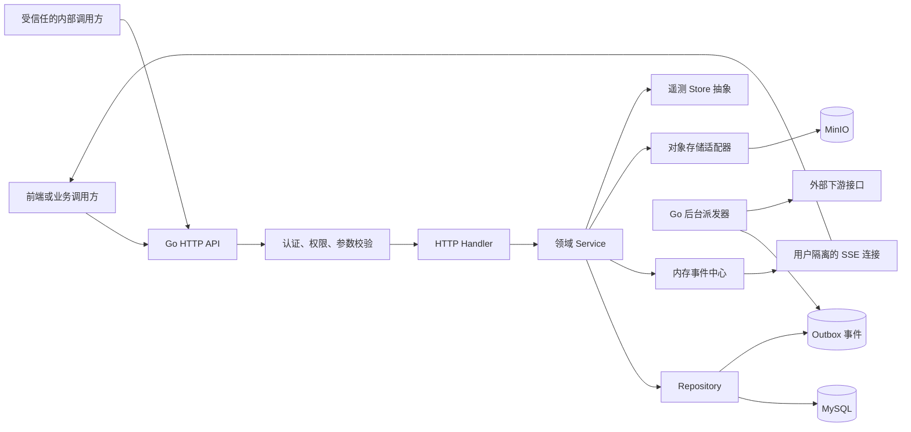

# 智慧农业 Go 服务整体架构与核心流程

## 1. 文档范围

本文描述当前仓库中 Go 服务的实际架构、模块职责、数据边界和核心业务流程。内容以现有代码为准，只覆盖 Go 进程负责的能力；外部下游只作为系统边界出现，不展开其内部实现。

Go 服务当前定位为智慧农业系统的业务事实中心，负责：

- 用户认证、账户状态和角色权限。
- 用户名下的地块、设备与绑定关系。
- 灌溉命令、命令查询和灌溉状态计算。
- 阈值规则、告警、通知和确认流程。
- Redis 最新温湿光快照、设备活跃状态、热点查询缓存以及看板与遥测查询接口。
- 面向浏览器的实时事件流。
- 会话、消息和知识文档等业务数据管理。
- 数据库迁移、健康检查、后台事件派发和优雅停机。

## 2. 总体架构

当前 Go 后端采用模块化单体：一个进程对外提供 HTTP API，各业务域在代码内独立分层，共享 MySQL 连接、实时事件中心和后台任务生命周期。



一次普通业务请求的处理顺序为：

1. 路由匹配请求。
2. 中间件验证访问令牌或内部服务密钥。
3. Handler 解析路径、查询参数和请求体。
4. Service 执行业务校验、状态转换和结果组装。
5. Repository 在用户归属约束下读写 MySQL。
6. Handler 使用统一响应结构返回结果。

## 3. 代码组织

```text
backend/
├─ cmd/api/                       # 进程入口、依赖装配、后台任务、优雅停机
├─ internal/
│  ├─ http/                       # 路由、鉴权中间件、请求与响应转换
│  ├─ config/                     # 环境变量读取和启动配置校验
│  ├─ identity/                   # 用户、角色、密码和访问令牌
│  ├─ plot/                       # 地块及用户归属
│  ├─ device/                     # 设备、绑定和状态查询
│  ├─ control/                    # 灌溉命令与灌溉状态
│  ├─ alert/                      # 阈值规则、告警和告警派发
│  ├─ telemetry/                  # 最新遥测与历史趋势读取抽象
│  ├─ events/                     # SSE 事件发布、隔离和短期重放
│  ├─ notification/               # 站内通知模型
│  ├─ outbox/                     # 可靠异步事件及认领状态
│  ├─ audit/                      # 操作审计模型
│  ├─ agent/                      # Go 侧会话与消息数据管理
│  ├─ knowledge/                  # 文档元数据、状态流转和事件派发
│  ├─ platform/database/          # MySQL 连接和嵌入式迁移
│  ├─ platform/objectstore/       # MinIO 适配
│  └─ shared/persistence/         # 公共时间字段和基础 Repository
└─ compose.yaml                   # 本地 MySQL 与 MinIO
```

业务包通常遵循以下职责边界：

| 层 | 主要职责 | 不应承担的职责 |
| --- | --- | --- |
| Handler | HTTP 参数解析、认证信息提取、错误码映射、响应组装 | 直接拼复杂查询或决定领域状态 |
| Service | 输入规范化、业务规则、状态转换、跨仓储流程 | 依赖具体 HTTP 对象 |
| Repository | 用户归属约束、查询、事务、行锁和持久化 | 组装 HTTP 响应 |
| Model | 数据实体、状态枚举和公共字段 | 发起外部调用 |

## 4. 启动与运行时装配

Go 进程启动时按以下顺序初始化：

1. 读取并校验服务端口、MySQL、JWT、内部密钥、对象存储和后台派发配置。
2. 建立 MySQL 连接并配置连接池。
3. 在启用迁移时执行嵌入式 SQL 迁移。
4. 创建令牌管理器及各领域 Repository、Service。
5. 创建容量为 512 条历史事件的内存事件中心。
6. 在对象存储启用时连接 MinIO，并确认 Bucket 可用。
7. 根据配置启动知识文档和告警 Outbox 派发器。
8. 注册 HTTP 路由并启动服务器。
9. 收到退出信号后停止后台任务，并在超时窗口内优雅关闭 HTTP 服务。

健康检查分为：

- Liveness：只判断 Go 进程是否存活。
- Readiness：在 1 秒超时内检查 MySQL 是否可用。

## 5. 模块职责

### 5.1 认证与权限

认证模块负责注册、登录、JWT 签发、当前用户查询和请求鉴权。

核心规则：

- 密码只保存哈希值，不在 API 中返回。
- JWT 包含用户 ID、用户名和角色，并校验签发方、有效期和签名。
- 每次鉴权除校验 JWT 外，还会读取当前用户状态；账户一旦停用，未过期的旧令牌也不能继续访问。
- 数据库查询异常与无效令牌分开处理，避免把服务异常伪装成登录失效。
- 管理型接口除登录校验外，还要求 `SYSTEM_ADMIN` 角色。
- 内部接口不使用用户 JWT，而使用独立的内部服务密钥。

### 5.2 地块

地块是用户数据隔离的核心边界。`plots.owner_id` 直接指向用户，后续设备、命令、阈值和告警都通过地块归属校验访问权限。

地块模块当前提供只读列表和详情。列表中的遥测、设备汇总和告警数量字段尚未在地块 Service 内聚合，因此基础地块列表会返回空值或零；看板和专用遥测接口负责组合实时数据。

### 5.3 设备与绑定

设备本体和地块绑定关系分开保存：

- `devices` 保存序列号、设备类型、状态、电量、信号和固件信息。
- `device_bindings` 保存设备和地块的绑定历史。
- `unbound_at IS NULL` 表示当前有效绑定。

绑定流程在一个事务中完成：

1. 校验目标地块属于当前用户。
2. 按设备序列号加锁查询设备。
3. 设备不存在时创建；已存在时校验登记类型一致。
4. 检查是否已有有效绑定。
5. 更新设备名称并创建新绑定。

解绑不会删除设备或历史绑定，而是写入解绑时间。列表和状态查询只返回当前用户地块上的有效绑定设备。

### 5.4 灌溉控制

控制模块负责下发命令、命令审计、命令结果和灌溉状态计算。

下发命令的业务保护包括：

- 请求必须带 `Idempotency-Key`；同一用户重复使用相同键时返回原命令。
- 只允许 `OPEN` 和 `CLOSE`。
- 开启时长为 60～1800 秒，关闭命令不能附带开启时长。
- 地块必须属于当前用户，且绑定的灌溉阀门必须在线。
- 命令和操作人、地块、设备、请求参数及执行时间一并保存。

当前实现中的命令执行是演示闭环：命令保存为 `PENDING` 后立即更新为 `SUCCEEDED`，尚未连接真实设备消息下发与回执状态机。

灌溉状态不直接读取“最后一条命令”，而是读取最近一条 `ACKNOWLEDGED` 或 `SUCCEEDED` 命令：

- 最近成功命令为关闭时，状态为 `OFF`。
- 最近成功命令为开启时，根据命令执行时间和持续时长计算剩余秒数。
- 后续失败、超时、拒绝或过期命令不会错误覆盖已生效状态。

命令完成后会向当前用户的事件流发布 `command.result`。

### 5.5 阈值与告警

阈值规则描述地块指标的比较条件、阈值、持续时间、告警等级和回差值。

规则更新具有以下语义：

- 路径中的规则 ID 不存在时可创建新规则。
- 已存在规则只能在原所属地块内更新。
- `hysteresis` 未提供时保留数据库中的原值；显式提供时才覆盖。
- 回差值不能为负，用于避免指标在阈值附近波动时频繁触发。

内部告警触发在一个 MySQL 事务中完成：

1. 对告警规则加行锁，确认规则存在且启用。
2. 校验可选设备确实绑定到规则所属地块。
3. 查找同一规则是否已有 `ACTIVE`、`CONFIRMED` 或旧版 `ACKNOWLEDGED` 告警。
4. 已存在时返回原告警，不重复创建。
5. 不存在时创建 `ACTIVE` 告警。
6. 为地块所有者创建一条已发送的站内通知。
7. 保存一条 `ALERT_TRIGGERED` Outbox 事件。
8. 事务提交后发布 `alert.created` 实时事件。

告警确认流程使用行锁串行化并支持幂等：

- `ACTIVE` 可转换为 `CONFIRMED`，并保存确认人、确认时间和备注。
- 已经是 `CONFIRMED` 或旧版 `ACKNOWLEDGED` 时直接返回原结果。
- 重复确认不会覆盖第一次确认的时间和备注。
- 已恢复或已关闭告警不能再次确认。

旧的 `ACKNOWLEDGED` 告警在列表中统一映射为 `CONFIRMED`。

### 5.6 看板与遥测

看板是一个组合查询接口，依次读取当前用户的地块、每块地的最新遥测、设备统计和告警统计，再生成总览数据。

遥测模块通过 `Store` 接口隔离数据来源，向 HTTP 层提供三类能力：

- 单地块最新快照。
- 多地块最新快照。
- 单指标在指定时间窗口内的聚合趋势。

启用 Redis 时，当前进程为最新遥测装配 `RedisStore`：

- 单地块和多地块最新值读取 `agri:v1:telemetry:latest:{plotId}`，批量读取使用 `MGET`。
- 快照包含温度、土壤湿度、光照和三类警告状态，按服务端接收时间拒绝旧值覆盖。
- 设备在线状态由 owner 维度 Sorted Set 中的最后接收时间推导，不接受设备自报状态、电量或信号。
- 历史趋势已接入 TDengine（`TDENGINE_ENABLED=true` 时装配 `TDengineStore`）：MQTT 遥测经 `IngestService` 批量异步写入 `readings` 超级表，趋势查询用 `INTERVAL` 时间桶聚合 avg/min/max 并 `FILL(PREV)` 补空桶；未启用时仍由 `NullStore` 返回空点集。

Redis 关闭时最新值使用 `NullStore`；Redis 启用但运行期不可用时，实时接口明确返回服务错误。内部 `IngestService` 已限制设备负载只能包含温度、土壤湿度、光照及三类布尔警告，设备、owner、地块和接收时间由可信消息上下文补充。

### 5.7 实时事件

实时事件模块使用进程内 Broker 管理 SSE 连接：

- 订阅按用户 ID 分组，实现用户隔离。
- 保存最近 512 条事件用于短期断线重放。
- 客户端通过 `Last-Event-ID` 请求漏掉的后续事件。
- 每 15 秒发送心跳，保持连接并及时发现断线。
- 慢客户端的缓冲区满时会被断开，避免阻塞业务发布；客户端可重连并重放。

Go 服务定义五种事件：遥测更新、告警创建、告警恢复、设备状态变化和命令结果。当前业务链路已经直接发布告警创建和命令结果；其余事件已提供发布入口，等待对应数据接入流程调用。

事件历史只存在于当前进程内，进程重启后不会保留，也不能自动跨多个 Go 实例共享。

### 5.8 会话与消息数据

Go 侧会话模块只负责业务数据管理：

- 创建属于当前用户的会话，可选关联地块。
- 分页查询当前用户会话中的消息。
- 幂等关闭会话。
- 允许受信任的内部调用方写入 `USER`、`ASSISTANT`、`SYSTEM` 或 `TOOL` 消息。
- 保存引用信息、地块、模型版本和追踪 ID。

会话查询始终带用户归属条件；内部写消息接口使用内部服务密钥。该模块不负责生成回答、检索内容或执行模型调用。

### 5.9 知识文档

知识文档由“文件对象”和“MySQL 元数据”组成：

- 文件内容存入 MinIO。
- 标题、分类、哈希、版本、状态和操作人保存到 MySQL。
- 普通登录用户只能列出 `ACTIVE` 文档。
- 上传、审批、发布和归档要求 `SYSTEM_ADMIN`。
- 有效状态流为 `DRAFT` → `APPROVED` → `ACTIVE` → `ARCHIVED`。
- 同标题的新版本发布时，原有活动版本会在同一事务中自动归档。
- 活动文档列表返回短期有效的签名下载地址。

上传时 Go 服务先读取并校验文件、计算 SHA-256、生成对象键并上传；随后在数据库中登记文档、审计记录和 Outbox 事件。如果数据库登记失败，会主动删除已上传对象，避免留下孤儿文件。

对象存储未启用时，查询元数据仍可工作，但上传会返回服务不可用。

### 5.10 Outbox 与后台派发

Outbox 用于处理“数据库已经提交，但外部通知可能失败”的场景。

核心状态为：

- `PENDING`：等待发送。
- `PROCESSING`：已由某个工作实例认领。
- `PUBLISHED`：发送成功。
- `FAILED`：发送失败，等待重试。

派发器按事件类型前缀认领任务，并使用行锁与 `SKIP LOCKED` 避免多个实例重复处理同一批事件。任务认领后带租约；发送成功标记为已发布，失败则记录原因、增加重试次数并推迟下次执行时间。

告警和知识文档派发器只有在对应下游地址已配置时才启动。未配置时，事件保留在 Outbox 中，不影响核心业务事务完成。

## 6. 数据架构

### 6.1 MySQL 数据分组

| 领域 | 主要表 | 说明 |
| --- | --- | --- |
| 认证 | `users`、`roles`、`user_roles` | 用户、状态和角色关系 |
| 地块 | `plots` | 通过 `owner_id` 归属用户 |
| 设备 | `devices`、`device_bindings` | 设备本体与可追溯绑定历史 |
| 告警 | `alert_rules`、`alerts`、`notifications` | 规则、告警和站内通知 |
| 控制 | `device_commands` | 命令、幂等键、执行状态和操作人 |
| 可靠事件 | `outbox_events` | 事务后异步派发 |
| 审计 | `audit_logs` | 管理操作追踪 |
| 会话 | `chat_sessions`、`chat_messages`、`ai_suggestions` | Go 侧会话事实数据 |
| 知识文档 | `knowledge_documents` | 文件元数据和生命周期 |

### 6.2 主要归属链

```text
用户
└─ 地块
   ├─ 当前设备绑定 ─ 设备
   ├─ 阈值规则 ─ 告警 ─ 通知
   └─ 灌溉命令

用户
└─ 会话 ─ 消息
```

绝大多数查询不只按资源 ID 查询，而是通过地块或会话关联用户 ID，从数据访问层阻止越权访问。

### 6.3 数据一致性边界

当前明确使用事务的场景包括：

- 设备绑定与解绑。
- 阈值规则归属校验及新增/更新。
- 告警去重、告警落库、站内通知和 Outbox 事件。
- 告警确认状态转换。
- 知识文档登记、审计和 Outbox 事件。
- Outbox 批量认领。

涉及并发状态判断时使用行锁，避免重复绑定、重复活动告警或重复确认覆盖数据。

## 7. 关键端到端流程

### 7.1 登录与访问业务接口

```text
提交用户名和密码
→ 校验用户存在、密码正确、账户启用
→ 返回访问令牌
→ 后续请求携带令牌
→ 校验令牌签名和有效期
→ 再次检查账户当前状态
→ 将用户 ID 和角色传入业务处理
```

### 7.2 设备绑定

```text
用户选择自己的地块并提交设备序列号
→ 校验地块归属
→ 查询或登记设备
→ 校验设备类型
→ 检查是否已有有效绑定
→ 创建绑定关系
→ 后续列表、状态和控制查询均通过绑定关系访问设备
```

### 7.3 灌溉控制

```text
客户端生成幂等键
→ 提交开启或关闭命令
→ 检查是否已有同幂等键命令
→ 校验地块、阀门和在线状态
→ 保存命令及请求参数
→ 更新命令结果
→ 发布 command.result
→ 状态接口根据最近成功命令计算阀门状态和剩余时间
```

### 7.4 告警闭环

```text
内部监测结果触发规则
→ 锁定规则并校验启用状态
→ 去重未结束告警
→ 同一事务创建告警、站内通知和 Outbox
→ 发布 alert.created
→ 用户查看告警
→ 用户提交确认备注
→ 状态转为 CONFIRMED
→ 重复确认返回第一次确认结果
```

### 7.5 知识文档发布

```text
管理员上传文件
→ 校验大小和元数据
→ 保存文件对象
→ 登记 DRAFT 元数据、审计和 Outbox
→ 管理员审批为 APPROVED
→ 管理员发布为 ACTIVE
→ 登录用户可查询并获得临时下载地址
→ 管理员归档为 ARCHIVED
```

## 8. 可靠性与安全设计

### 8.1 安全

- 密码使用强哈希校验。
- JWT 密钥和内部服务密钥启动时要求至少 32 个字符。
- 业务接口按用户 ID 隔离数据。
- 管理操作检查角色。
- 内部服务密钥使用常量时间比较。
- 请求参数限制长度、页大小、时间窗口和上传大小。
- 上传文件使用随机对象键，下载通过短期签名地址。
- 生产环境不应使用仓库中的开发默认密码和密钥。

### 8.2 幂等与并发

- 灌溉命令依赖客户端幂等键去重。
- 告警触发按规则去重未结束告警。
- 告警确认和会话关闭可安全重试。
- 设备绑定、告警触发和告警确认使用事务及行锁。
- Outbox 任务使用认领租约和失败重试。

### 8.3 故障隔离

- 告警或文档的外部通知失败不会回滚已经提交的核心业务数据。
- 慢 SSE 客户端不会阻塞事件发布。
- 对象上传后若数据库登记失败，会清理已上传文件。
- Readiness 在数据库不可用时返回 `DOWN`，便于停止接收流量。
- 退出时先停止后台任务，再优雅关闭 HTTP 服务。

## 9. 配置边界

配置主要分为五组：

| 分组 | 关键配置 | 作用 |
| --- | --- | --- |
| 服务 | `SERVER_PORT`、`GIN_MODE` | 监听端口和运行模式 |
| MySQL | `DB_DSN` 或数据库连接字段、连接池、`DB_MIGRATE` | 业务持久化和迁移 |
| 认证 | `JWT_SECRET`、`JWT_ISSUER`、`JWT_TTL` | 访问令牌 |
| 内部通信 | `INTERNAL_SERVICE_KEY`、下游 URL、派发周期、批量大小、超时 | 内部接口和 Outbox 派发 |
| 对象存储 | `OBJECT_STORAGE_ENABLED`、MinIO 地址和凭证、Bucket、上传限制、签名时长 | 知识文档文件 |

所有数据库时间按 UTC 处理，HTTP 时间使用带时区的 ISO 8601 表示。

## 10. 当前实现边界

以下是理解和部署当前 Go 服务时必须注意的事实：

1. 最新遥测已接入 Redis，历史趋势已接入 TDengine（启用 `TDENGINE_ENABLED` 时）：MQTT 遥测批量写入 `readings` 超级表（`agri_telemetry` 库，`t_{plotId}_{deviceId}` 子表，tag=owner/plot/device），趋势接口按 `INTERVAL` 桶聚合；TDengine 关闭时历史趋势降级为 `NullStore` 空点集。
2. 灌溉命令当前是演示执行路径，保存后立即成功，没有真实设备消息下发和回执。
3. SSE Broker 和事件重放历史保存在单个 Go 进程内，重启会丢失历史，多实例之间不共享。
4. Go 会话模块只负责会话和消息数据，不负责回答生成。
5. Outbox 只有配置下游地址后才会实际发送，否则事件会继续保存在 MySQL。
6. MinIO 默认可以关闭；关闭时文档上传不可用。
7. 告警恢复和遥测更新等事件类型已有模型，但对应的完整采集闭环尚未全部接入当前进程。

这些边界不改变现有 API 契约，但会影响运行环境中能够看到的实时数据和设备控制效果。

## 11. 测试与演进建议

当前 Go 项目已有单元测试、HTTP 契约测试和基于 MySQL 的可选集成测试。修改业务逻辑时至少应覆盖：

- 用户归属与越权访问。
- JWT 失效及账户停用。
- 设备重复绑定和解绑。
- 灌溉幂等键、在线状态和命令状态计算。
- 告警触发去重、确认幂等和阈值回差保留。
- Outbox 事务一致性与失败重试。
- SSE 用户隔离、断线重放和慢连接处理。
- 知识文档状态流转及对象清理。

后续接入真实遥测、设备消息或多实例部署时，应优先替换现有抽象层，而不是让 Handler 直接依赖具体基础设施：

- 为 `telemetry.Store` 提供更多真实来源（当前已装配 Redis 最新值 + TDengine 历史趋势）。
- 将控制模块的演示成功逻辑替换为异步命令状态机。
- 将 SSE 历史和跨实例广播迁移到共享事件设施。
- 为新增外部通知继续使用事务 Outbox，保持核心业务与外部可用性解耦。
